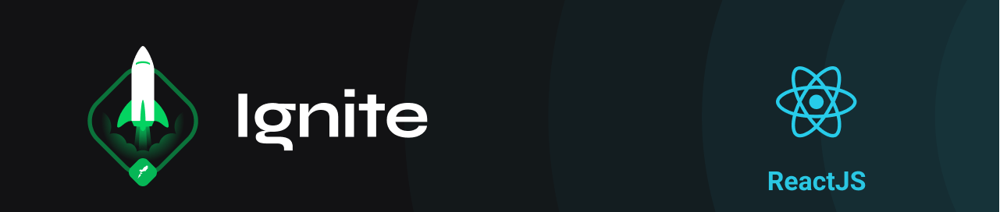

    

Project build as the second module of <strong>Ignite, an educational program by <a href="rocketseat.com.br/" target="_blank">Rocketseat</strong></a>

  

<small style="font-family:monospace;">
The Ignite's ReactJS Leaning Pathway is taught by <a href="https://www.linkedin.com/in/diego-schell-fernandes" target="_blank">Diego Fernandes</a>
</small>

## Chapter II - Building React Applications

     

        <strong>1 - Scaffolding the App</strong>
     

    <ol style="list-style:none">
        <li>☑️ Introduction to the module</li>
        <li>☑️ Create react-app</li>
        <li>☑️ Exporting assets from Figma</li>
        <li>☑️ First steps with Styled Components</li>
        <li>☑️ Implementing global styles</li>
        <li>☑️ Fonts from Google Fonts</li>
    </ol>

